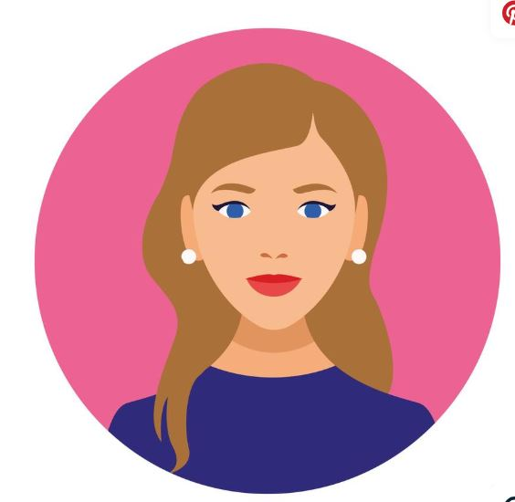

# Welcome to My Portfolio! 👋

<!-- Menu Bar -->

  <a href="#education" style="color: white; text-decoration: none; margin: 0 15px; font-weight: bold;">Education</a>
  <a href="#experience" style="color: white; text-decoration: none; margin: 0 15px; font-weight: bold;">Experience</a>
  <a href="#projects" style="color: white; text-decoration: none; margin: 0 15px; font-weight: bold;">Projects</a>
  <a href="#certifications" style="color: white; text-decoration: none; margin: 0 15px; font-weight: bold;">Certifications</a>
  <a href="#skills" style="color: white; text-decoration: none; margin: 0 15px; font-weight: bold;">Skills</a>
  <a href="#contact" style="color: white; text-decoration: none; margin: 0 15px; font-weight: bold;">Contact</a>

---

 
Hi there! I'm **[Your Name]**, a passionate **[Your Profession]** with a keen interest in **[Your Field/Industry]**. Here, you'll find information about my education, work experience, skills, certifications, publications, and more. Feel free to explore!

---

## 📄 Download My Resume

  

---

## 📚 Education

### [Your Degree or Program] - [Institution Name]  
_Year of Graduation: [YYYY]_  
- Relevant Coursework: [List of relevant courses or subjects]
- Achievements: [Any awards or honors received]

### [Any Additional Degree or Certificate]  
_Year of Graduation: [YYYY]_  
- Relevant Coursework: [List of relevant courses or subjects]
- Achievements: [Any awards or honors received]

---

## 💼 Experience

### [Job Title] – [Company Name]  
_Year of Employment: [YYYY – YYYY]_  
- **Key Responsibilities**:
  - [Your responsibility or task]
  - [Your responsibility or task]
- **Key Achievements**:
  - [Highlight your contributions, results, or impact]
  - [Highlight any awards or recognitions]

### [Previous Job Title] – [Previous Company Name]  
_Year of Employment: [YYYY – YYYY]_  
- **Key Responsibilities**:
  - [Your responsibility or task]
  - [Your responsibility or task]
- **Key Achievements**:
  - [Highlight your contributions, results, or impact]
  - [Highlight any awards or recognitions]

---

## 📂 Projects
<!-- Flex container -->

  <!-- Project Card 1 -->
  

    
    

      <h3>Project Name 1</h3>
      
A brief description of the project. Explains what it does and its core features.

      
<strong>Technologies Used:</strong> HTML, CSS, JavaScript

      <a href="https://your-project-link.com" style="text-decoration: none; color: white; background-color: #4CAF50; padding: 10px 15px; border-radius: 5px; font-weight: bold;">Live Demo</a>
      <a href="https://github.com/yourusername/project1" style="text-decoration: none; color: white; background-color: #333; padding: 10px 15px; border-radius: 5px; font-weight: bold; margin-left: 10px;">GitHub</a>
    

  

  <!-- Project Card 2 -->
  

    
    

      <h3>Project Name 2</h3>
      
A brief description of the project. Explains what it does and its core features.

      
<strong>Technologies Used:</strong> React, Node.js

      <a href="https://your-project-link.com" style="text-decoration: none; color: white; background-color: #4CAF50; padding: 10px 15px; border-radius: 5px; font-weight: bold;">Live Demo</a>
      <a href="https://github.com/yourusername/project2" style="text-decoration: none; color: white; background-color: #333; padding: 10px 15px; border-radius: 5px; font-weight: bold; margin-left: 10px;">GitHub</a>
    

  

  <!-- Project Card 3 -->
  

    
    

      <h3>Project Name 3</h3>
      
A brief description of the project. Explains what it does and its core features.

      
<strong>Technologies Used:</strong> Vue, Firebase

      <a href="https://your-project-link.com" style="text-decoration: none; color: white; background-color: #4CAF50; padding: 10px 15px; border-radius: 5px; font-weight: bold;">Live Demo</a>
      <a href="https://github.com/yourusername/project3" style="text-decoration: none; color: white; background-color: #333; padding: 10px 15px; border-radius: 5px; font-weight: bold; margin-left: 10px;">GitHub</a>
    

  

 <!-- End of flex container -->

<!-- Responsive Design for smaller screens -->

------

## 🏅 Certifications

- **[Certification Title]** – [Issuing Organization]  
  _Date Issued: [YYYY]_
- **[Certification Title]** – [Issuing Organization]  
  _Date Issued: [YYYY]_

---

## 💻 Skills

- **Programming Languages**: [Python, JavaScript, etc.]
- **Web Technologies**: [HTML, CSS, JavaScript, etc.]
- **Software & Tools**: [Photoshop, VS Code, Git, etc.]
- **Other Skills**: [Communication, Project Management, etc.]

---

## 📖 Publications

- **[Publication Title]**  
  _Published: [Date]_  
  [Link to publication]
  - **Summary**: [Brief description of the publication and your role in it]

- **[Publication Title]**  
  _Published: [Date]_  
  [Link to publication]
  - **Summary**: [Brief description of the publication and your role in it]

---

## 🎮 Extra-Curricular Activities

- **[Organization/Club Name]** – [Role]  
  _Year: [YYYY – YYYY]_  
  - [Brief description of your involvement and achievements]
  
- **[Organization/Club Name]** – [Role]  
  _Year: [YYYY – YYYY]_  
  - [Brief description of your involvement and achievements]

---

## 🌐 Connect with Me

- **LinkedIn**: 
- **GitHub**: 
- **Email**: 
- **Website**: 

---

Thanks for visiting my portfolio! Feel free to explore my repositories, contact me, or connect on social media. Let's collaborate! ✨
